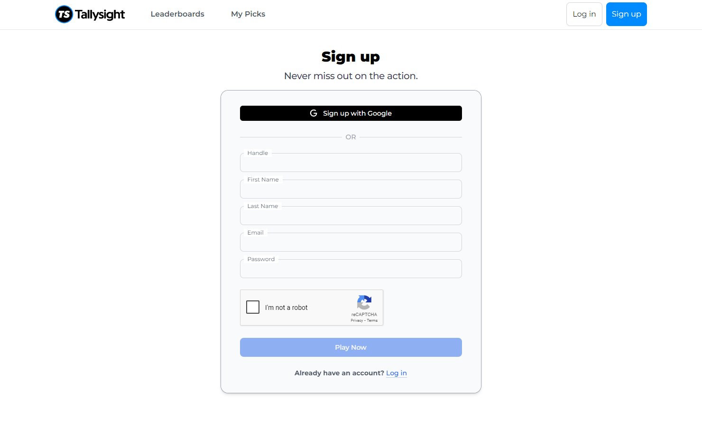
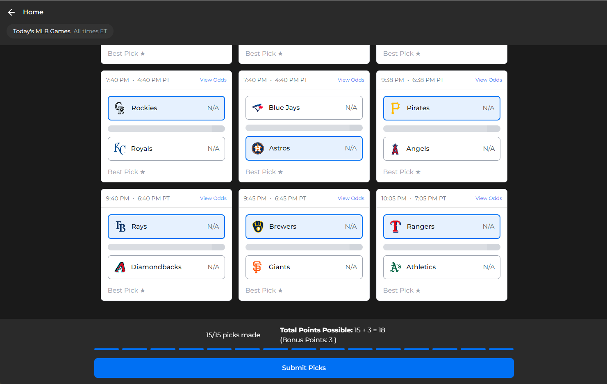
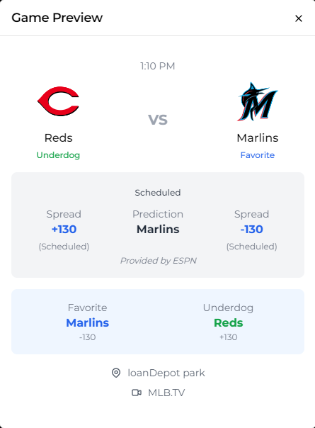
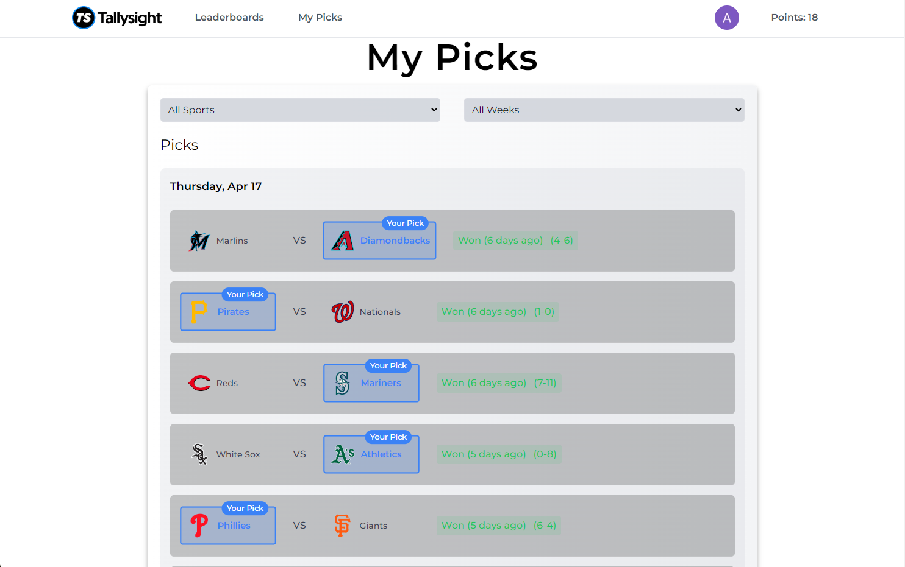
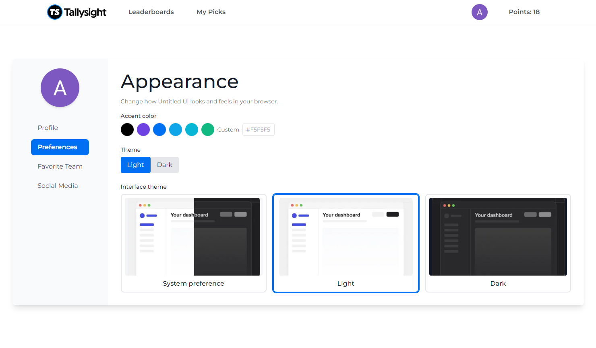

<div align="center">

  
  <h1><a href="https://tallysight-kappa.vercel.app" target="_blank">Tallysight</a> – A Free Sports Picking Web Application</h1>
  
  <p>
    Engage with the sports community, participate in free-to-play contests, and climb the leaderboard—all without real money!
  </p>
  
</div>

---

## :notebook_with_decorative_cover: Table of Contents
- [Synopsis](#star2-synopsis)
- [Features](#dart-features)
- [Screenshots](#camera-screenshots)
- [Tech Stack](#space_invader-tech-stack)
- [Timeline](#date-timeline)
- [Getting Started](#toolbox-getting-started)
  - [Developer Instructions](#gear-developer-instructions)
- [Testing](#test_tube-testing)
- [Deployment](#triangular_flag_on_post-deployment)
- [Acknowledgments](#gem-acknowledgments)
- [Contact](#handshake-contact)

---

## :star2: Synopsis
**Tallysight** is a dynamic web application enabling users to make picks on real-time sports and discover sports content creators and media brands in the sports gaming industry. Picks integrate real-time sports data while connections to sports brands and creators leverage Tallysight’s database to provide advanced search capabilities, customizable filters, and seamless navigation, delivering an enhanced and user-friendly experience.

Primary users include:
- Sports fans
- Sports bettors
- Beginners in sports picking

---

## :dart: Features

### User Authentication & Scalable Platform
- **Secure Authentication**: Integrated with Clerk for seamless and secure user account creation, login, and email verification, ensuring a smooth onboarding experience while safeguarding user data.
- **Scalability & Accessibility**: Deployed on **Vercel** to ensure optimal performance, reliability, and minimal downtime, providing a fast and accessible platform for all users.

### Seamless Data Management & Real-Time Insights
- **Real-Time Sports Data**: Connects to live sports and odds APIs (e.g., ESPN, The Odds) to provide users with up-to-date information on teams, games, and events, enhancing the overall experience.
- **Performance Tracking**: Enables users to track their picks, view past performance, and analyze selections over time with a secure and dynamic database.

### Dynamic Content & Engaging UX
- **Interactive Leaderboards**: Weekly and cumulative leaderboards to highlight top-performing users and foster a competitive community.
- **Customized Profiles**: Users can personalize their profiles with preferences and favorite teams for a tailored experience.

---

## :camera: Screenshots

### Sign-In Page
<div align="center"> 
  
  <p><i>Sign In Page with Google Sign In Option</i></p>
</div>

---

### Sign-Up Page
<div align="center"> 
  
  <p><i>Sign Up Page with Account Creation or Sign Up with Google Option</i></p>
</div>

---

### Quick Picks Page
<div align="center"> 
  
  <p><i>Quick Picks Page with Review Menu Open to Select Picks from Real-Time Games</i></p>
</div>

---

### Game Details and Odds
<div align="center"> 
  
  <p><i>Game Details and Odds Provided by ESPN and The Odds</i></p>
</div>

---

### My Picks
<div align="center"> 
  
  <p><i>My Picks of the Current Week the User Selected Saved in the Database</i></p>
</div>

---

### Contest Page
<div align="center"> 
  
  <p><i>Contest Page Users Can Enter In</i></p>
</div>

---

### Profile Page
<div align="center"> 
  
  <p><i>Profile Page Where Users Can Change Information</i></p>
</div>

---

## :space_invader: Tech Stack
- **Frontend**: Next.js, TailwindCSS
- **Backend**: TypeScript, Vercel, Prisma
- **Database**: Vercel PostgreSQL
- **APIs**: Sports data integration with ESPN and The Odds

---

## :date: Timeline
Based on user stories in our JIRA backlog, the following milestones will guide development during CSC 191:

| Milestone                               | Deadline           |
|-----------------------------------------|--------------------|
| Database Integration w/ Entire Page     | February 3, 2025   |
| Admin Page & Functions                  | February 16, 2025  |
| Email Notifications                     | March 2, 2025      |
| Bug Fixes and Optimization for Mobile   | March 16, 2025     |
| Final Deliverable                       | May 22, 2025       |

---

## :toolbox: Getting Started

### :gear: Developer Instructions
1. **Clone the repo**:
   ```bash
   git clone https://github.com/allanhy/tallysight.git
   cd tallysight
   ```
2. **Install dependencies**:
   ```bash
   npm install
   ```
3. **Run Application**:
   ```bash
   npm run dev
   ```
---

## :test_tube: Testing

---

## :triangular_flag_on_post: Deployment
  ```bash
  vercel deploy
  ```
---

## :gem: Acknowledgments
- **Tallysight**: For their support, guidance, and trust.
- **CSU Sacramento**: For facilitating the senior project.
- Open-source libraries including TailwindCSS, Next.js, EPSN, and The Odds.

---

## :handshake: Contact
- **Cynthia Angulo**: cangulo@csus.edu
- **Jeremy Auradou**: jauradou@csus.edu
- **Anthony Hernandez**: ahernandez56@csus.edu
- **Allan Hy**: allanhy@csus.edu
- **James Pullin**: jamespullin@csus.edu
- **Oscar Villalobos**: oscarvillalobos@csus.edu
- **Mursal Yari**: myari@csus.edu
- **Sosan Yari**: syari@csus.edu
- **Katrina Yu**: katrinayu@csus.edu
