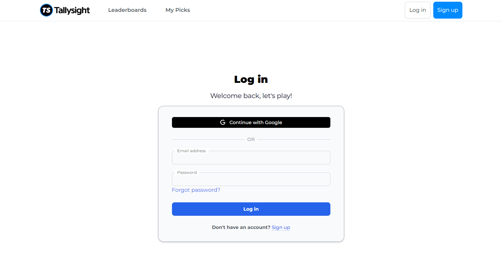

<div align="center">

  
  <h1><a href="https://tallysight-kappa.vercel.app" target="_blank">Tallysight</a> – A Free Sports Picking Web Application</h1>
  
  <p>
    Engage with the sports community, participate in free-to-play contests, and climb the leaderboard—all without real money!
  </p>
  
</div>

---

## :notebook_with_decorative_cover: Table of Contents
- [Synopsis](#star2-synopsis)
- [Features](#dart-features)
- [Screenshots](#camera-screenshots)
- [Tech Stack](#space_invader-tech-stack)
- [Timeline](#date-timeline)
- [Getting Started](#toolbox-getting-started)
  - [Developer Instructions](#gear-developer-instructions)
- [Testing](#test_tube-testing)
- [Deployment](#triangular_flag_on_post-deployment)
- [Acknowledgments](#gem-acknowledgments)
- [Contact](#handshake-contact)

---

## :star2: Synopsis
**Tallysight** is a dynamic web application enabling users to make picks on real-time sports and track their performance over time. Picks integrate real-time sports data and offers an engaging and competitive experience through leaderboards, personalized profiles, and performance analytics, delivering an enhanced and user-friendly experience.

Primary users include:
- Sports fans
- Sports bettors
- Beginners in sports picking

---

## :dart: Features

### User Authentication & Scalable Platform
- **Secure Authentication**: Integrated with Clerk for seamless and secure user account creation, login, and email verification, ensuring a smooth onboarding experience while safeguarding user data.
- **Scalability & Accessibility**: Deployed on **Vercel** to ensure optimal performance, reliability, and minimal downtime, providing a fast and accessible platform for all users.

### Seamless Data Management & Real-Time Insights
- **Real-Time Sports Data**: Connects to live sports and odds APIs (e.g., ESPN) to provide users with up-to-date information on teams, games, and events, enhancing the overall experience.
- **Performance Tracking**: Enables users to track their picks, view past performance, and analyze selections over time with a secure and dynamic database.
- **Automated Game Syncing**: Games and scores are automatically synced into the database through scheduled jobs (cron) or manual triggers via the admin portal.
- **Automated Reminders**: Users receive weekly emails reminding them to submit their picks before contests close.
- **Live Odds & Pick Percentages**: Odds from ESPN and real-time pick distribution (via Pusher) are displayed per game to inform smarter picks.

### Dynamic Content & Engaging UX
- **Interactive Leaderboards**: Weekly and cumulative leaderboards to highlight top-performing users and foster a competitive community.
- **Customized Profiles**: Users can personalize their profiles with application preferences, favorite teams, and social media handles for a tailored experience.

---

## :camera: Screenshots

### Sign-In Page
<div align="center"> 
  
  <p><i>Sign In Page with Google Sign In Option</i></p>
</div>

---

### Sign-Up Page
<div align="center"> 
  
  <p><i>Sign Up Page with Account Creation or Sign Up with Google Option</i></p>
</div>

---

### Daily Picks Page
<div align="center"> 
  
  <p><i>Daily Picks Page with Review Menu Open to Select Picks from Real-Time Games</i></p>
</div>

---

### Game Details and Odds
<div align="center"> 
  
  <p><i>Game Details and Odds Provided by ESPN</i></p>
</div>

---

### My Picks
<div align="center"> 
  
  <p><i>My Picks of the Current Week the User Selected Saved in the Database</i></p>
</div>

---

### Contest Page
<div align="center"> 
  
  <p><i>Contest Page Users Can Enter In</i></p>
</div>

---

### Profile Page
<div align="center"> 
  
  <p><i>Profile Page Where Users Can Change Information Including There Preferences</i></p>
</div>

---

## :space_invader: Tech Stack
- **Frontend**: Next.js, TailwindCSS
- **Backend**: TypeScript, Vercel
- **Database**: Vercel PostgreSQL
- **APIs**: Sports data integration with ESPN, live user percentage using Pusher, security and verification using Clerk and reCAPTCHA

---

## :toolbox: Getting Started
### 📦 Requirements
- [Node.js](https://nodejs.org/) (v18 or later recommended)
- npm (comes with Node)

### 🧾 External Accounts (Required to Run the App)
To fully set up and run the project, you’ll need accounts with the following services:

- [Clerk](https://clerk.com/) – for user authentication (get API keys)
- [Vercel](https://vercel.com/) – for deployment and environment management
- [Pusher](https://pusher.com/) – for real-time pick percentages (get API keys)
- [Google reCAPTCHA](https://www.google.com/recaptcha/admin) – for bot protection on sign-up

> After creating these accounts, copy the necessary keys and secrets into your `.env.local` file


### :gear: Developer Instructions
1. **Clone the repo**:
   ```bash
   git clone https://github.com/allanhy/tallysight.git
   ```
   ```bash
   cd tallysight
   ```
2. **Install dependencies**:
   ```bash
   npm install
   ```
3. **Environment variables**: Copy the provided `.env.example` file to `.env.local` and fill in the required values:
    ```bash
    cp .env.example .env.local
    ```
4. **Run Application**:
   ```bash
   npm run dev
   ```
---

## :test_tube: Testing
### 🧪 Automated Testing

This project includes basic unit and integration testing with real data and hitting the live APIs using **Jest**.

To run tests locally:

```bash
npm run test
```
---

## :triangular_flag_on_post: Deployment
This project is deployed with [Vercel](https://vercel.com).

> 🚀 Automatic deployments are triggered when you push to the `main` branch via Git.

If you want to deploy manually using the Vercel CLI:
1. **Make sure to be logged into your Vercel account**
```bash
npx vercel login
```
2. **Link to the correct project before deploying manually**
```bash
npx vercel link
```
3. **Manually deploy**
```bash
npx vercel
```
---

## :gem: Acknowledgments
- **Tallysight**: For their support, guidance, and trust.
- **CSU Sacramento**: For facilitating the senior project.
- Open-source libraries including TailwindCSS, Next.js, EPSN.

---

## :handshake: Contact
- **[Cynthia Angulo](https://github.com/Kinikiaa)**: cangulo@csus.edu
- **[Jeremy Auradou](https://github.com/JeremyAuradou)**: jauradou@csus.edu
- **[Anthony Hernandez](https://github.com/ahern2212)**: ahernandez56@csus.edu
- **[Allan Hy](https://github.com/allanhy)**: allanhy@csus.edu
- **[James Pullin](https://github.com/OscarVillaloboss)**: jamespullin@csus.edu
- **[Oscar Villalobos](https://github.com/OscarVillaloboss)**: oscarvillalobos@csus.edu
- **[Mursal Yari](https://github.com/Myari1)**: myari@csus.edu
- **[Sosan Yari](https://github.com/SosanY)**: syari@csus.edu
- **[Katrina Yu](https://github.com/kyu2509)**: katrinayu@csus.edu
